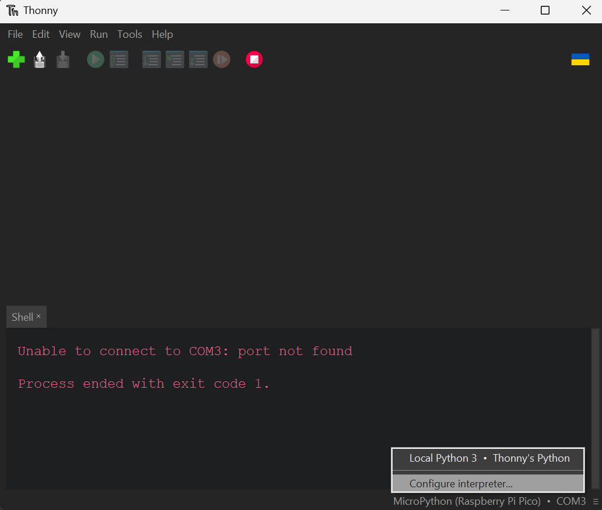
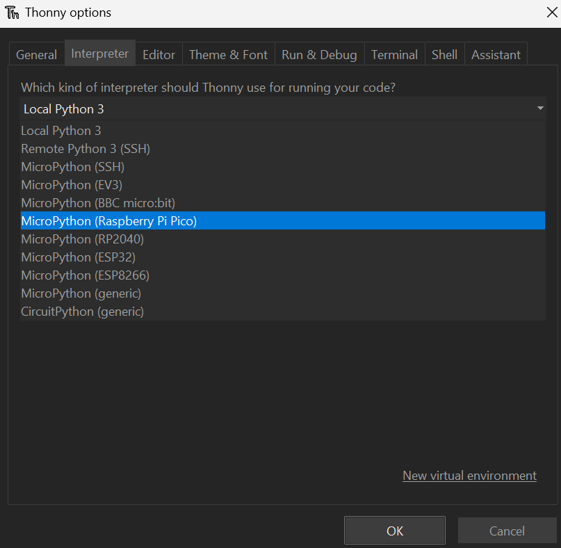
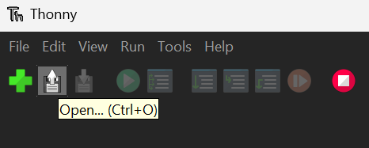

# License

This application is released under the **Apache License, Version2.0**. See the '**LICENSE.txt**' file for details.

**main.py** uses **PySide6**, which is released under the LGPL v3 license. See [here](https://www.qt.io/licensing/) for more information.

**send-request.py** uses **requests**, which is released under the **Apache License, Version2.0**.

# 変数の設定

**使用する際は，main関数内の#で囲まれた変数を変更してください．**

main.pyでは受信機側のIPアドレス，pico-script.pyではSSID・wifiパスワード・IPアドレス・呼び鈴継続時間・各種ピン番号の設定ができます

# Pico Wの設定

### UF2ファームウェアのインストール

1. [Raspberry Pi財団サイト](https://www.raspberrypi.com/documentation/microcontrollers/micropython.html)にアクセスしてRaspberry Pi Pico WのUF2ファイルをダウンロードする。
2. Pico WをBOOTSELボタンを押しながらPCと接続し、ドライブが表示されたらボタンを離す。
3. ダウンロードしたファイルをPico Wのドライブにドラッグアンドドロップする。

### Thonnyのインストールと設定

1. [https://thonny.org/](https://thonny.org/)からThonnyをダウンロードする。
2. インストーラの指示通りにインストールする。
3. Thonnyを開き、右下をクリックし、[Configure interpreter(インタプリタ設定)]を押す。
4. インタプリタをMicroPython (Raspberry Pi Pico)に変更する。

### プログラムの書き込み

1. pico-script.pyをダウンロードする。
2. Pico WをPCに接続する。
3. Thonnyを開き、右上のOpen(FDのアイコン)を押し、pico-script.pyを選択する。
   
4. Runを押す
