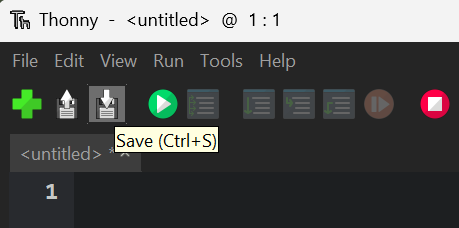
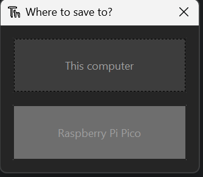
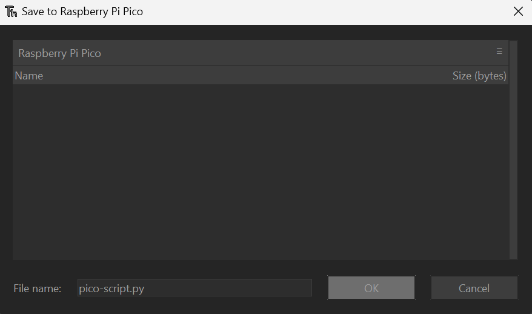

# License

This application is released under the **LGPL v3** License. See the '**LICENSE.txt**' file for details.

**main.py** uses **PySide6**, which is released under the **LGPL v3** license. See [here](https://www.qt.io/licensing/) for more information.

**send-request.py** uses **requests**, which is released under the **Apache License, Version2.0**.

# ファイルについて

* main.py ...送信機側のGUIなど
* send-request.py ...main.pyから送信先IPを受け取り，HTTPリクエストを送信．
* pico-script.py ...受信機(RasPi Pico)側
* LICENSE.txt ...ライセンス(LGPL v3, Apache License v2.0)
* requirements.txt

# 変数の設定

**使用する際は，main関数内の#で囲まれた変数を変更してください．**

main.pyでは受信機側のIPアドレス，pico-script.pyではSSID・wifiパスワード・IPアドレス・呼び鈴継続時間・各種ピン番号の設定ができます．

# Pico Wの設定

Pico Wを使うには，以下の設定が必要です．

### UF2ファームウェアのインストール

1. [Raspberry Pi財団サイト](https://www.raspberrypi.com/documentation/microcontrollers/micropython.html)にアクセスしてRaspberry Pi Pico WのUF2ファイルをダウンロードする．
2. Pico WをBOOTSELボタンを押しながらPCと接続し，ドライブが表示されたらボタンを離す．
3. ダウンロードしたファイルをPico Wのドライブにドラッグアンドドロップする．

### Thonnyのインストールと設定

1. [https://thonny.org/](https://thonny.org/)からThonnyをダウンロードする．
2. インストーラの指示通りにインストールする．
3. Thonnyを開き，右下をクリックし，[Configure interpreter(インタプリタ設定)]を押す．
4. インタプリタをMicroPython (Raspberry Pi Pico)に変更する。
   

### プログラムの書き込み

1. Pico WをPCに接続する．
2. pico-script.pyをダウンロードする．
3. Thonnyを開き，pico-script.pyの中身をコピペする．
4. Saveを押し，保存先にRaspberry Pi Picoを選択．ファイル名をmain.pyにして保存する．
   

   

   
